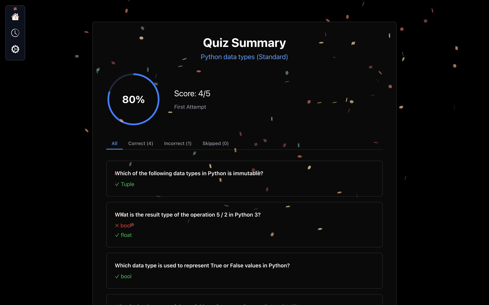
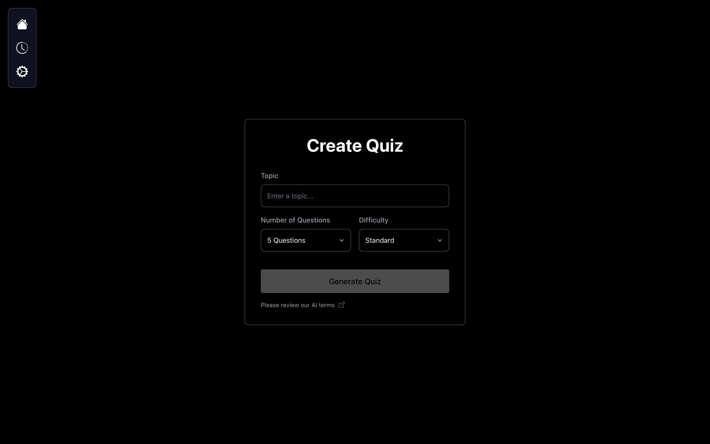
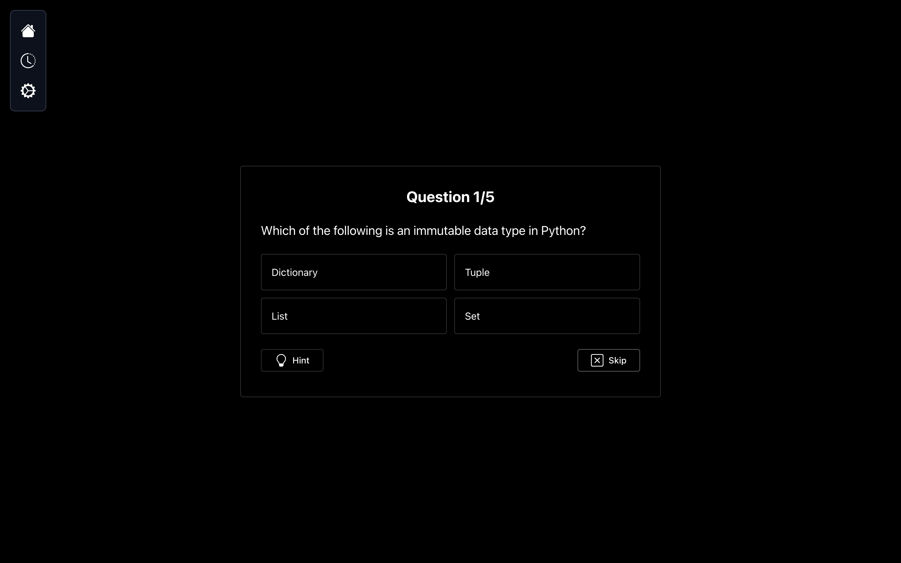
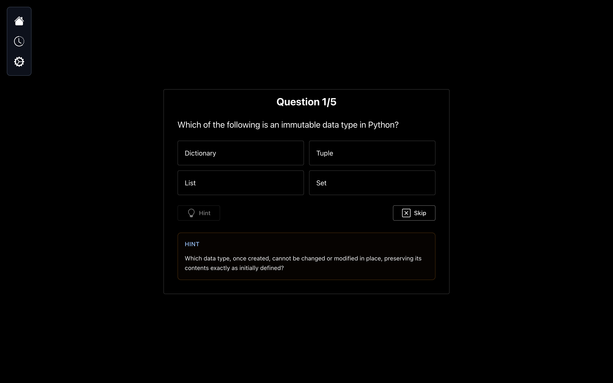
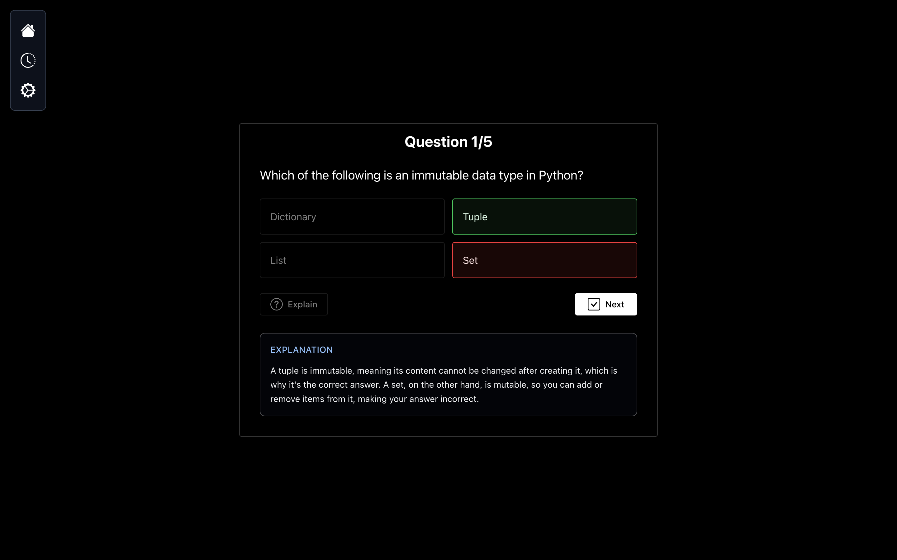
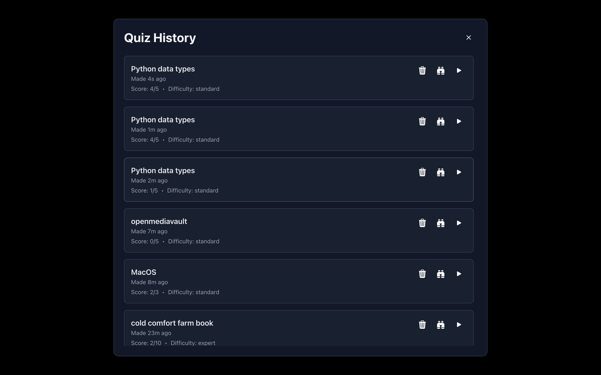
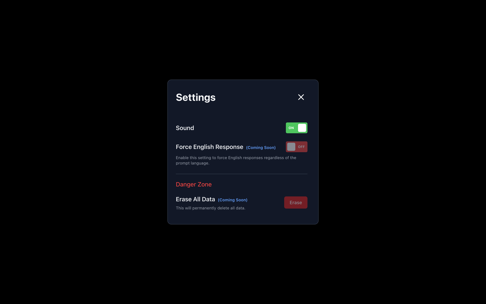

# Das Quiz

Das Quiz is a web-based quiz application that allows users to create multiple-choice quizzes using AI.



## Features

1. Quiz creation from a simple prompt
2. Selectors for quiz difficulty and number of questions
3. Animated loading screen
4. Slick UI with dark mode for questions and sound effects
5. Built-in keyboard shortcuts for navigation (enter, esc)
6. Button to give a hint or explain the answer using AI
7. End screen with a summary of the quiz
8. History of quizzes taken using IndexedDB
9. Ability to review past quizzes and retake them
10. Score comparison from previous attempts
11. AI disclaimer
12. Settings menu with reactive sound toggle

## Technologies Used
- Next.js
- TypeScript

## Installation
1. Clone the repository
    ```bash
    gh repo clone beck1888/das-quiz
    ```

2. Create a `.env.local` file in the root directory and add your OpenAI API key:
    ```bash
    OPENAI_API_KEY=your_openai_api_key
    ```

3. Install dependencies:
    ```bash
    npm install
    ```

4. Start the server:

    For development mode:
    ```bash
    npm run dev
    ```

    OR


    For production mode:
    ```bash
    npm run build && npm start
    ```

5. Open your browser and navigate to `http://localhost:3000` to view the application.

## Credits

- [Next.js](https://nextjs.org/)
- [Bootstrap Icons](https://icons.getbootstrap.com/)
- [OpenAI](https://openai.com/)
- [Pixabay](https://pixabay.com/)

## License
I am not licensing this project. You are free for anything you want to do with it. I am not responsible for any consequences of your actions. Make sure to respect the licenses of the libraries used in this project. Also double-check any assets for copyright issues if you deploy this app.

## Screenshots
### Creating a Quiz


### Example Question


### Example Hint and Explanation



### Quiz Summary


### Quiz History


### Quiz Settings
